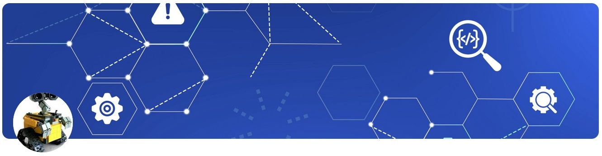

<!-- ============================================== -->
<!-- 1. SEO METADATA (Hidden from visual display) -->
<!-- ============================================== -->
<!-- 
  - Description: Appears in Google search results (keep under 160 chars)
  - Keywords: 5-8 key terms for search engines
  - Canonical: Prevents duplicate content issues
-->
<meta name="description" content="electric scooter & BLDC motor control projects by RomiranE-bike - STM32 firmware and FOC motor control">
<meta name="keywords" content="e-bike, electric scooter, BLDC motor control, RomiranE-bike,iran ,mazandaran,mahmoud esmaeili">
<link rel="canonical" href="https://github.com/RomiranE-bike">

<!-- ======================== -->
<!-- 2. PROFILE HEADER -->
<!-- ======================== -->
<!-- 
  - Logo: Use 200x200px for best results
    PROFILE HEADER - Visual introduction with branding
  • Centered logo with alt text for accessibility/SEO
  • Main title (H1) with primary keyword
  • Subtitle (H2) with secondary keyword
  • Badges for important links (styled with shields.io)
  - Badges: Link to key resources
-->

  <!-- Profile image with alt text for accessibility -->
  
  

  
  

  # Romiran E-Bike Projects

  ### ⚠️ Intellectual Property Notice
  

    <strong>  PROJECT OWNERSHIP NOTICE: </strong>   
    • The RomiranE-bike electric scooter project represents proprietary research and development work.
      All intellectual property rights (including but not limited to the RomiranE-bike name, logo, 
      designs, technical documentation, and product concepts) are exclusively owned by RomiranE-bike.
  
    • This repository is shared for educational and collaborative purposes only.
      Commercial use, reproduction, or derivative works require express written permission.
  

<!-- -->
## Hi there 👋
# Welcome to My Profile!
This resource or repository is for educational and research purposes.
# 
# Thanks to GENIRAN FAN ( با سپاس از ژنیران فن)

## 📌 Pinned Repositories
<!--START_SECTION:automated-pins-->
<!-- Automatically generated pins will appear here -->
<!--END_SECTION:automated-pins-->

## 🔍 My Repositories 
- [Romiran_Ebike_project](https://github.com/RomiranE-bike/Romiran_Ebike_project) - The Romiran electric scooter project is an ambitious personal idea that I am building and developing with the aim of producing and commercializing it. I own the ownership or rights to the name, logo, design, idea, and document. Any use of them is subject to obtaining permission.
- [BLDC_motor_project](https://github.com/RomiranE-bike/BLDC_motor_project) - Brushless DC motor operation and testing.
- [my_art](https://github.com/RomiranE-bike/my_art) - Artistic wooden creations for friends.
- [function-genrator](https://github.com/RomiranE-bike/function-genrator) - Ultrasonic wave generator with ATTiny26.  
- [AT-89S52-project](https://github.com/RomiranE-bike/AT-89S52-project) - Project to create ultrasonic waves with swing and pattern capabilities with AT89S52.
- 
- [Thermo_7Seg](https://github.com/RomiranE-bike/Thermo_7Seg) - 
Multi-sensor thermoswitch with temperature adjustment capability and seven-segment display.
- [HV_Programmer](https://github.com/RomiranE-bike/HV_Programmer) - AVR Resetter.
- [RGB_LED](https://github.com/RomiranE-bike/RGB_LED) - Color combination flasher.
- 
- [tse-app1401](https://github.com/RomiranE-bike/tse-app1401) - market data scraping and analysis.
- [eflask-app1400](https://github.com/RomiranE-bike/eflask-app1400) - this is a test for heroku and flask app deployment.
- [git-heroku-setup](https://github.com/RomiranE-bike/git-heroku-setup) - some tips for git and heroku-00-11-27
- 

## 🌱 Current Development Focus

- **FOC Algorithms**
- **STM32F103C8T6**
- **Ultrasonic Wave swing and pattern**

---

<!-- 
  FOOTER - Engagement elements
  • GitHub Stats API for dynamic metrics
  • Visitor counter badge
  • Structured data for rich snippets
-->

  
  
  
  
  
  
  

  
<!--
**********************************
**RomiranE-bike/RomiranE-bike** is a ✨ _special_ ✨ repository because its `README.md` (this file) appears on your GitHub profile.

Here are some ideas to get you started:

- 🔭 I’m currently working on ...
- 🌱 I’m currently learning ...
- 👯 I’m looking to collaborate on ...
- 🤔 I’m looking for help with ...
- 💬 Ask me about ...
- 📫 How to reach me: ...
- 😄 Pronouns: ...
- ⚡ Fun fact: ...
*******************************************
-->
